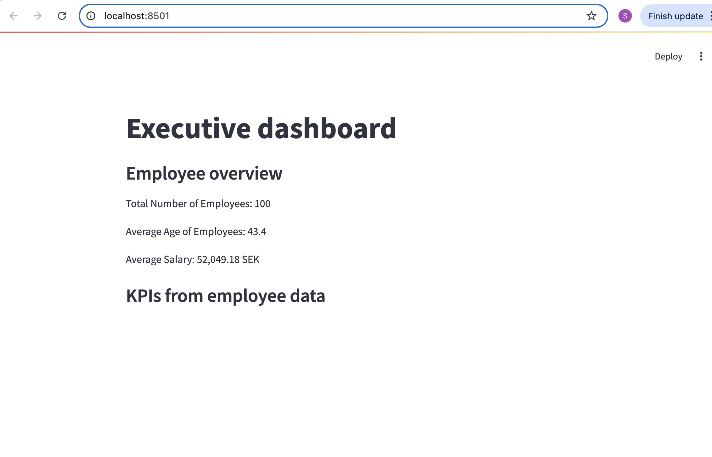

# Executive Dashboard

A simple web-based data visualization dashboard built in Python.

This project showcases my skills in:

- `pandas` for data handling
- `streamlit` for building the interactive web app
- `matplotlib.pyplot` and `plotly_express` for plotting graphs and charts

### What it does:

- Reads employee data from a CSV file: "supahcoolsoft.csv"
- Displays total employee count, average age, and average salary
- Shows a searchable employee table
- Visualizes:
  - Bar chart: number of employees per department
  - Histogram: salary distribution
  - Box plot: salaries by department
  - Histogram: age distribution
  - Box plot: ages by department

### How it works:

Run the dashboard locally with:

```bash
Executive_Dashboard/streamlit run dashboard.py

### Dashboard Preview


